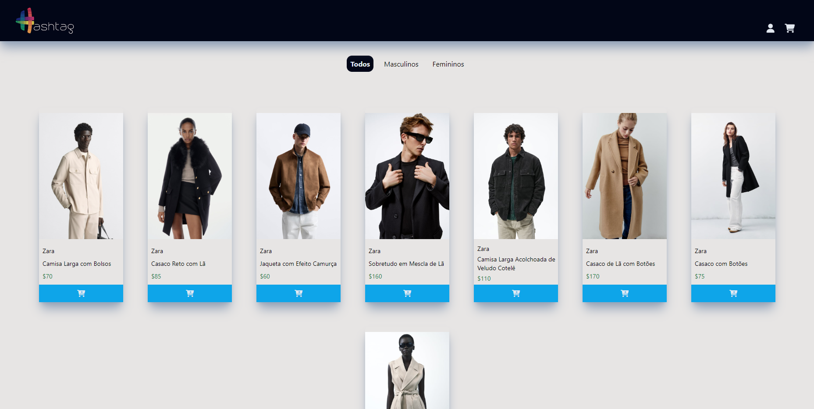

# First-E-Commerce
Primeiro site feito usando HTML, CSS e Java Script.

# Para rodar
 - Instale o NodeJS
 - Instale o ViteJS
 - Abra o powershel no diretório onde estão salvos os arquivos
 - Rode o comando "npm run dev"
 - Abra o URL no seu navegador de preferência

# Página principal do site

